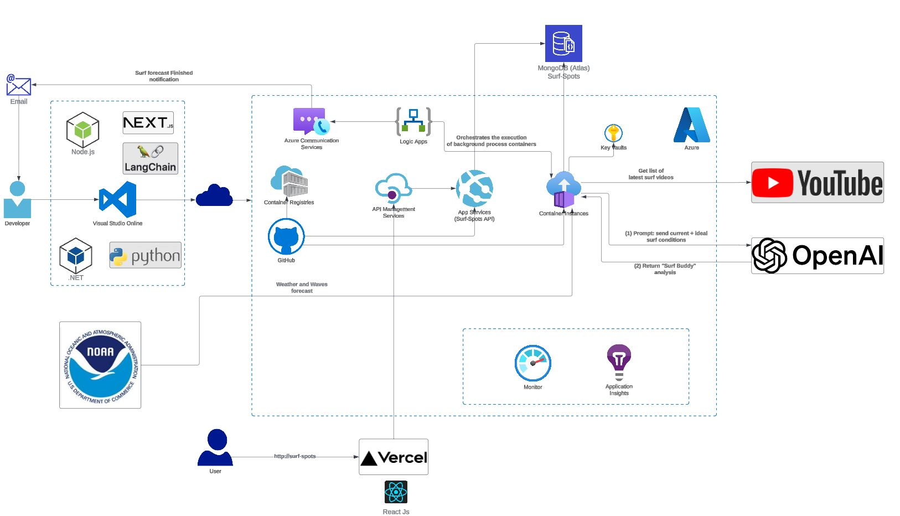

# Surfbros
Using LangChain to generate surf reports like a pro surfer!

Live App Demo: [https://openai-video-summary-fe.vercel.app/](https://surf-spots-ui.vercel.app/home)

Medium article: [https://medium.com/@felipecembranelli/youtubeblink-an-openai-video-summary-generator-37ab541c9493](https://medium.com/@felipecembranelli/creating-a-surf-report-buddy-using-ai-d99d0527e5f1)

## Do you want access to the source code?

Please send me a message: felipecembranelli@live.com

## Architecture Overview

